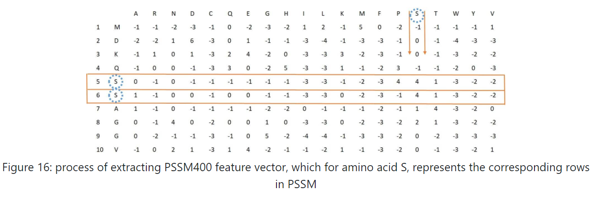

# PSSMCOOL

This package includs all features that has been extracted from Position-Specific Scoring Matrix (PSSM) in POSSUM website: http://possum.erc.monash.edu/ and some of other features
from several articles. each function in this package corresponds to one feature that has extracted from PSSM Matrix.

###### **Install from GitHub :  devtools::install_github("BioCool-Lab/PSSMCOOL")**


## 1 Preface
<br></br>
<font size="4"> Feature extraction or feature encoding is a fundamental step in the construction of high-quality machine learning-based models. Specifically, this is a key step for determining the effectiveness of the trained models in bioinformatics applications. In the last two decades, a variety of feature encoding schemes have been proposed in order to exploit useful patterns from protein sequences. Such schemes are often based on sequence information or physicochemical properties of amino acids. Although direct features derived from sequences themselves (such as amino acid compositions, dipeptide compositions, and counting of k-mers) are regarded as essential for training models, an increasing number of studies have shown that evolutionary information in the form of PSSM profiles is much more informative than sequence information alone. Accordingly, PSSM-based feature descriptors have been commonly used as indispensable primary features to construct models, filling a major gap in the current bioinformatics research. For example, PSSM-based feature descriptors have successfully improved the prediction performance of structural and functional properties of proteins across a wide spectrum of bioinformatics applications. These predictions can be applied for protein fold recognition and the prediction of protein structural classes, protein-protein interactions, protein subcellular localization, RNA-binding sites, and protein functions. But at the same time, there is no comprehensive, simple tool in the R programming language for extracting all of these features from the PSSM and displaying it in the output. PSSMCOOL package here is developed in R for these purposes. First, in Figure 1 which is a table that lists all of the features implemented in this package with their feature-lengths is brought. Then each one of these features will be explained in full detail.</font>

<br></br>

<font size="4"> PSSMCOOL Package is currently available on CRAN website:</font>

[ https://CRAN.R-project.org/package=PSSMCOOL]( https://CRAN.R-project.org/package=PSSMCOOL)

<br></br>

<font size="4"> for issues about this package :</font>

[https://github.com/BioCool-Lab/PSSMCOOL/issues](https://github.com/BioCool-Lab/PSSMCOOL/issues)

<br></br>

<pre>                  Figure 1: List of implemented features in PSSMCOOL package </pre>

<br>*feature vector length depends on the choice of parameter</br>  **these features produce Matrix of features which its dimension depends on choice of parameter

<br></br>

```{r}
library(PSSMCOOL)
```

## 2 PSSM-AC
<font size="4">This feature, which stands for auto-covariance transformation, for column j, calculates the average of this column as shown in Figure 2, Then subtracts the resulting number from the elements on the rows i and i + g of this column, and finally multiplies them and calculates the sum by changing the variable i from 1 to L-g. Because the variable j changes between 1 and 20 and the variable g changes between 1 and 10, eventually a feature vector of length 200 will be obtained.</font>

<br></br>

<br></br>
<pre>                         Figure 2: process of extracting PSSM-AC feature vector from PSSM Matrix </pre>


#### Usage of this feature in PSSMCOOL package:
```
 w<-PSSMAC(system.file("extdata", "C7GQS7.txt.pssm", package="PSSMCOOL"))
 head(w, n = 50)
```
```
##  [1]  0.0092  0.0070  0.0181  0.0072 -0.0032  0.0054 -0.0068 -0.0065 -0.0015
## [10] -0.0032  0.0057  0.0102  0.0059  0.0087  0.0176  0.0072  0.0141 -0.0080
## [19] -0.0132  0.0109  0.0271  0.0064  0.0080  0.0107  0.0130  0.0024  0.0062
## [28]  0.0126  0.0108  0.0061  0.0159 -0.0024  0.0157  0.0102 -0.0052  0.0141
## [37] -0.0023 -0.0097  0.0244  0.0333  0.0094  0.0132 -0.0003 -0.0006  0.0158
## [46]  0.0068  0.0094 -0.0069  0.0085 -0.0109
```

## 3 DPC-PSSM
<font size="4">This feature stands for dipeptide composition, which multiplies the values that are located in two consecutive rows and two different columns. Having calculated these values for different rows and columns, they are summed. Next, for both columns, the sum is divided by L-1. Since the result depends on two different columns, eventually a feature vector of length 400, according to Figure 3 and following equation ,will be obtained.</font>


<pre>                      Figure 3: process of extracting DPC-PSSM feature vector from PSSM Matrix </pre>


<font size="4">In the above equation, 's, are the PSSM elements and 's are the 20x20 matrix elements, which by placing the rows of this matrix next to each other, DPC-PSSM feature vector of length 400 is obtained.</font>

#### Usage of this feature in PSSMCOOL package:
```
 ss<-DPC_PSSM(system.file("extdata", "C7GQS7.txt.pssm", package="PSSMCOOL"))
head(ss, n = 50)
```
```
##  [1] 0.3773 0.2965 0.3371 0.3049 0.1816 0.4356 0.3395 0.2866 0.3109 0.2576
## [11] 0.2622 0.3150 0.2776 0.3187 0.2383 0.3846 0.2755 0.1791 0.2180 0.2808
## [21] 0.1528 0.1218 0.1387 0.1063 0.0794 0.1766 0.1235 0.1070 0.1410 0.1055
## [31] 0.1085 0.1235 0.1078 0.1354 0.0858 0.1631 0.1174 0.0823 0.0939 0.1186
## [41] 0.1241 0.0928 0.1133 0.0890 0.0416 0.1248 0.0982 0.0916 0.0916 0.0746
```

## 4 Trigram-PSSM
<font size="4">This feature vector is of length 8000, which is extracted from the PSSM. If we multiply elements available in three consecutive rows and three different columns of the PSSM by each other, and apply this to all rows (all three consecutive rows) and then sum these numbers, eventually one of the elements of feature vector with length 8000 corresponding to the three selected columns will be obtained. Because we have 20 different columns, The final feature vector will be of length 8000 = 20 * 20 * 20. Figure 4: shows these steps. For example, in this figure for three marked rows and columns, the numbers obtained from the intersection of these rows and columns marked with a blue dotted circle around them, are multiplied to each other. </font>


<pre>                      Figure 4: process of extracting trigram-PSSM feature vector from PSSM </pre>


#### Usage of this feature in PSSMCOOL package:
```
as<-trigrame_pssm(paste0(system.file("extdata",package="PSSMCOOL"),"/C7GSI6.txt.pssm"))
head(as, n = 50)
```
```
##  [1] 6.8369 3.7511 4.1531 2.6852 2.6406 4.3763 2.8829 4.2257 3.7228 5.1379
## [11] 5.2524 4.4484 5.1002 3.8583 5.1569 7.5018 5.2072 2.4309 2.8760 5.6669
## [21] 3.5204 3.0895 2.7871 1.9459 0.7295 3.4388 2.1569 2.4319 3.2735 1.6680
## [31] 1.9269 3.1770 2.1466 2.0473 3.1579 4.1613 2.8492 1.5444 1.8998 1.9281
## [41] 3.3102 2.3229 2.7297 1.6388 1.3118 3.0535 1.9647 2.2095 2.7645 2.8273
```

## 5 Pse-PSSM
<font size="4"> The length of this feature vector is 320. The first 20 numbers of this feature vector are the mean of 20 columns in PSSM, and the next values for each column are the mean squares of the difference between the elements of row i and i + lag in this column. Because the lag value varies between 1 and 15, the final feature vector will have a length of 320. Figure 5: and following equation shows the process of this function and the corresponding mathematical equation, respectively.</font>


<pre>                       Figure 5: process of extracting Pse-PSSM feature vector from PSSM </pre>


#### Usage of this feature in PSSMCOOL package:
```
 v<-pse_pssm(system.file("extdata", "C7GQS7.txt.pssm", package="PSSMCOOL"))
head(v, n = 50)
```
```
##  [1] 0.3773 0.2965 0.3371 0.3049 0.1816 0.4356 0.3395 0.2866 0.3109 0.2576
## [11] 0.2622 0.3150 0.2776 0.3187 0.2383 0.3846 0.2755 0.1791 0.2180 0.2808
## [21] 0.1636 0.1969 0.1304 0.2129 0.1649 0.1271 0.1766 0.1524 0.1649 0.1478
## [31] 0.1197 0.1964 0.1259 0.1896 0.1973 0.1181 0.0903 0.1807 0.1477 0.1717
## [41] 0.1693 0.1875 0.1729 0.2508 0.1585 0.1495 0.1832 0.1635 0.1666 0.1338
```

## 6 k-Separated-bigram-PSSM
<font size="4"> This feature is almost identical to the DPC feature, and in fact, the DPC feature is part of this feature (for k = 1) and for two different columns, it considers rows that have distance k.</font>


<pre>                  Figure 6: process of extracting K-separated-bigam-PSSM feature vector from PSSM </pre>  


#### Usage of this feature in PSSMCOOL package:
```
 w<-k_seperated_bigrame(system.file("extdata", "C7GQS7.txt.pssm", package="PSSMCOOL"),5)
head(w, n = 50)
```
```
##  [1] 17.8176 13.2148 15.5094 14.4319  8.3346 22.1273 16.1736 13.4963 13.7240
## [10] 11.5597 11.8734 14.7134 12.4310 17.7145 11.2181 18.3770 12.4118  8.3759
## [19] 10.2801 13.0504 14.3991 12.7802 13.3367 12.7504  6.5913 16.3527 13.2403
## [28]  9.4264 10.8272  8.9290  7.9045 12.3299  7.7908  8.3621 10.7674 15.1463
## [37] 10.1184  6.4232  6.2908 10.3672 14.7014 13.7350 16.3146 14.6568  7.6190
## [46] 20.1827 15.6412 13.8415 13.7924  8.5747
```

## 7 EDP-EEDP-MEDP
<font size="4"> In this group of features, in order to use uniform dimensions to show proteins of different lengths, in the first step, the average evolutionary score between adjacent residues is calculated using the following equations:</font>


<font size="4">Where L is equal to the length of the protein,  is the mean score of positions i and i-1, and  is the mean score of positions i and i+1. The evolutionary difference formula (EDF) is then defined as follows:</font>


<font size="4">  represents the mean of evolutionary difference between the residues of a given protein sequence. According to EDF, a given protein can be expressed by a 20 x 20 matrix called ED-PSSM, which is defined by the  equations</font>


<font size="4"> Using this ED-PSSM, the three features EDP, EEDP, and MEDP are defined by the equations
following equation, EDP has a length of 20, EEDP has a length of 400, and the MEDP feature is obtained by merging these two feature vectors.</font>

![EDP=[\psi_1,\psi_2,...,\psi_{20}]^T \quad where \quad \psi_t=\sum_{k=1}^{20}e_{k,t}/20 \quad ,t=1,2,...,20 \\
EEDP=[\psi_{21},\psi_{22},...,\psi_{420}]^T \quad where \quad \psi_u=e_{k,t} \quad ,u=21,22,...,420 \\
MEDP=[\psi_1,\psi_2,...,\psi_{420}]^T](https://latex.codecogs.com/svg.latex?EDP%3D%5B%5Cpsi_1%2C%5Cpsi_2%2C...%2C%5Cpsi_%7B20%7D%5D%5ET%20%5Cquad%20where%20%5Cquad%20%5Cpsi_t%3D%5Csum_%7Bk%3D1%7D%5E%7B20%7De_%7Bk%2Ct%7D/20%20%5Cquad%20%2Ct%3D1%2C2%2C...%2C20%20%5C%5C%20EEDP%3D%5B%5Cpsi_%7B21%7D%2C%5Cpsi_%7B22%7D%2C...%2C%5Cpsi_%7B420%7D%5D%5ET%20%5Cquad%20where%20%5Cquad%20%5Cpsi_u%3De_%7Bk%2Ct%7D%20%5Cquad%20%2Cu%3D21%2C22%2C...%2C420%20%5C%5C%20MEDP%3D%5B%5Cpsi_1%2C%5Cpsi_2%2C...%2C%5Cpsi_%7B420%7D%5D%5ET)

<font size="4"> Figure 7: also shows the process of this work. It is noteworthy that in the following equation the value of  is removed during the subtraction of  and , and therefore this value is not shown in Figure 7.</font>


<pre>                  Figure 7: process of extracting EDP-EEDP-MEDP feature vectors from PSSM </pre>

#### Usage of this feature in PSSMCOOL package:
```
 as<-EDP_MEDP(paste0(system.file("extdata",package="PSSMCOOL"),"/C7GS61.txt.pssm"))
head(as, n = 50)
```
```
##  [1] 0.0470 0.0270 0.0327 0.0310 0.0275 0.0284 0.0307 0.0380 0.0325 0.0425
## [11] 0.0394 0.0267 0.0329 0.0373 0.0334 0.0567 0.0558 0.0383 0.0350 0.0485
## [21] 0.0266 0.0521 0.0464 0.0549 0.0455 0.0409 0.0429 0.0520 0.0574 0.0428
## [31] 0.0425 0.0419 0.0354 0.0564 0.0492 0.0423 0.0436 0.0762 0.0549 0.0359
## [41] 0.0515 0.0095 0.0211 0.0154 0.0123 0.0171 0.0174 0.0290 0.0149 0.0347
```

## 8 AB-PSSM
<font size="4"> This feature consists of two types of feature vectors. At first, each protein sequence is divided into 20 equal parts, each of which is called a block, and in each block, the row vectors of the PSSM
related to that block are added together. The resulting final vector is divided by the length of that block, which is equal to 5% of protein length. Finally, by placing these 20 vectors side by side, the first feature vector of length 400 is obtained. The second feature for each amino acid in each column is the average of the positive numbers in that column and for each block, and these 20 values, corresponding to 20 blocks, are placed next to each other, and therefore for each of the 20 types of amino acids, a vector of length 20 is obtained, and by placing these together,the second feature vector of length 400, is obtained. Figure 8 represents this process.</font>


<pre>                       Figure 8: process of extracting AB-PSSM feature vectors from PSSM </pre>

#### Usage of this feature in PSSMCOOL package:
```
  zz<- AB_PSSM(system.file("extdata","C7GRQ3.txt.pssm",package="PSSMCOOL"))
head(zz[1], n = 50)
```
```
## [[1]]
##   [1] 0.3595 0.1202 0.3442 0.2908 0.0545 0.3715 0.3510 0.0816 0.1202 0.5049
##  [11] 0.3361 0.3861 0.4256 0.2303 0.1354 0.5385 0.5939 0.0278 0.1983 0.4214
##  [21] 0.6790 0.3226 0.6670 0.4566 0.1837 0.4365 0.5000 0.3562 0.4365 0.3546
##  [31] 0.2157 0.4615 0.3340 0.0664 0.4495 0.7409 0.6774 0.0327 0.0963 0.3460
##  [41] 0.4246 0.0571 0.3928 0.3598 0.1810 0.1769 0.3844 0.1568 0.1325 0.1810
##  [51] 0.2183 0.1967 0.1040 0.2167 0.5664 0.6090 0.4246 0.0095 0.1126 0.2028
##  [61] 0.3562 0.3961 0.2456 0.5310 0.0379 0.6522 0.7260 0.0519 0.2773 0.3794
##  [71] 0.2448 0.6587 0.1332 0.1951 0.2488 0.5583 0.6236 0.1798 0.1836 0.3659
##  [81] 0.4784 0.1351 0.2863 0.3325 0.4861 0.3323 0.3744 0.0590 0.1585 0.4641
##  [91] 0.4197 0.3057 0.3361 0.2889 0.0308 0.4194 0.4896 0.0191 0.1836 0.4511
## [101] 0.6639 0.2440 0.5651 0.6509 0.1202 0.5000 0.6774 0.3460 0.2591 0.2591
## [111] 0.2992 0.4750 0.1821 0.0963 0.2076 0.7159 0.6540 0.0425 0.1083 0.2591
## [121] 0.3725 0.1707 0.5000 0.6774 0.2623 0.4864 0.6654 0.3611 0.5583 0.1668
## [131] 0.1332 0.3628 0.1701 0.3242 0.4116 0.5635 0.4230 0.2857 0.5197 0.2087
## [141] 0.4615 0.1772 0.4929 0.5136 0.0914 0.5000 0.4750 0.3057 0.1788 0.1837
## [151] 0.1701 0.4631 0.1452 0.2053 0.3731 0.6139 0.6188 0.2013 0.1322 0.3476
## [161] 0.2461 0.1869 0.4197 0.2167 0.3073 0.3979 0.3941 0.1986 0.3708 0.5298
## [171] 0.3996 0.3390 0.2960 0.1684 0.0547 0.3947 0.5120 0.0659 0.1739 0.4951
## [181] 0.5586 0.3356 0.3976 0.1937 0.0447 0.4760 0.5003 0.1960 0.2209 0.3008
## [191] 0.3614 0.5616 0.1582 0.0547 0.1665 0.4763 0.3812 0.0142 0.0278 0.3627
## [201] 0.3760 0.3426 0.2342 0.0959 0.0346 0.3812 0.2154 0.0451 0.3520 0.0891
## [211] 0.1357 0.6648 0.2956 0.2079 0.3536 0.5045 0.4763 0.0278 0.2264 0.0491
## [221] 0.3073 0.0240 0.2523 0.0343 0.3199 0.1380 0.0282 0.0207 0.2364 0.4197
## [231] 0.2254 0.0233 0.1234 0.2630 0.0231 0.4732 0.5395 0.1674 0.2817 0.4977
## [241] 0.5884 0.3346 0.3812 0.3947 0.1923 0.5404 0.5216 0.4313 0.3193 0.4583
## [251] 0.3861 0.4880 0.3210 0.1273 0.2737 0.5651 0.5385 0.0327 0.0833 0.4534
## [261] 0.6654 0.2575 0.6269 0.5635 0.1572 0.5000 0.6405 0.6774 0.5770 0.2190
## [271] 0.2076 0.5000 0.2326 0.1468 0.5385 0.7560 0.6155 0.0474 0.1322 0.2960
## [281] 0.3210 0.4029 0.5071 0.3682 0.4511 0.2206 0.2542 0.2610 0.4145 0.2639
## [291] 0.2704 0.3611 0.2430 0.1635 0.1684 0.5838 0.3845 0.0327 0.1582 0.2618
## [301] 0.5169 0.1037 0.0756 0.1557 0.1458 0.0888 0.0418 0.3445 0.2564 0.2096
## [311] 0.1406 0.0717 0.1231 0.3712 0.0299 0.6062 0.3536 0.2284 0.3184 0.2779
## [321] 0.1866 0.2329 0.5026 0.5224 0.0884 0.2542 0.4347 0.2264 0.1582 0.0247
## [331] 0.0146 0.4253 0.0205 0.0059 0.1610 0.2759 0.3356 0.0040 0.0156 0.1360
## [341] 0.1701 0.1836 0.1869 0.0341 0.3225 0.2553 0.1133 0.0191 0.5418 0.3611
## [351] 0.4163 0.2128 0.2300 0.5189 0.0222 0.3562 0.3679 0.3881 0.6778 0.4246
## [361] 0.4864 0.2825 0.6524 0.7289 0.0425 0.4615 0.7611 0.7645 0.2342 0.0963
## [371] 0.0714 0.6654 0.1083 0.0628 0.3595 0.5000 0.3980 0.0964 0.1034 0.1023
## [381] 0.2007 0.2046 0.1458 0.1235 0.2044 0.1362 0.1407 0.0557 0.2154 0.6054
## [391] 0.4998 0.1505 0.5000 0.3558 0.0226 0.2677 0.2905 0.1722 0.3651 0.5821
```

## 9 AATP-TPC
<font size="4"> In this feature, at first, a TPM matrix is constructed from the PSSM, which has represented by a vector corresponding to the following equation:</font>


<font size="4">Where the components are as follows:</font>


<font size="4"> In the above equation, the numerator is the same as the equation related to DPC-PSSM feature without considering its coefficient. By placing these components together, a TPC feature vector of length 400 is obtained, and if we add the AAC feature vector of length 20 which is the average of columns of the PSSM to the beginning of this vector, AATP feature vector of length 420 is obtained.</font>

#### Usage of this feature in PSSMCOOL package:
```
 as<-AATP_TPCC(paste0(system.file("extdata",package="PSSMCOOL"),"/C7GQS7.txt.pssm"))
head(as, n = 50)
```
```
##  [1] 0.3773 0.2965 0.3371 0.3049 0.1816 0.4356 0.3395 0.2866 0.3109 0.2576
## [11] 0.2622 0.3150 0.2776 0.3187 0.2383 0.3846 0.2755 0.1791 0.2180 0.2808
## [21] 0.0640 0.0510 0.0580 0.0445 0.0332 0.0739 0.0517 0.0448 0.0590 0.0442
## [31] 0.0454 0.0517 0.0451 0.0567 0.0359 0.0683 0.0492 0.0344 0.0393 0.0496
## [41] 0.0706 0.0528 0.0645 0.0507 0.0237 0.0710 0.0559 0.0521 0.0521 0.0425
```

## 10 CS-PSe-PSSM
<font size="4"> This feature consists of a combination of several types of features, and in general, the obtained feature vector would be of length 700. Here all parts of this feature are described separately.</font>

## 10.1 CSAAC

<font size="4"> First, the consensus sequence is obtained from the PSSM according to the following equation, then from this consensus sequence next feature vectors are obtained </font>


<font size="4">where  is the index for the largest element in row i  of PSSM, and the ith component in the consensus sequence equal to the 'th amino acid in the standard amino acid alphabet which the column names of PSSM are labeled by them. Now, using the following equation, the feature vector of length 20 is obtained:</font>


<font size="4"> Here  shows the number of j-th amino acid occurrences in the consensus sequence </font>

## 10.2 CSCM

<font size="4">This feature vector is obtained using the following equation from the consensus sequence:</font>


<font size="4"> Here  shows the number of i-th amino acid occurrences in the consensus sequence and  indicates the j-th position of the i-th amino acid in the consensus sequence.</font>

## 10.3 Segmented PsePSSM features

<font size="4">Here the PSSM is divided into n segments, which corresponds to dividing the initial protein sequence into n segments,  if n = 2:</font>


<font size="4">Where L represents the length of the initial protein and indexed L's indicate the length of the first and second segments, respectively. Now, using the following equations, the feature vector components of length 200 are obtained</font>


<font size="4">And if n = 3 then we have:</font>


<font size="4">Therefore, using the following equations, the  components of a feature vector with length 180 are obtained as follows:</font>


<font size="4">In total, using the previous feature vector, a feature vector of length 380 is obtained for this group.</font>

## 10.4 Segmented ACTPSSM features
<font size="4">In this group, using the previous equations and the following equations, the feature vector of length 280 could be obtained. when n=2:</font>


<font size="4">when n=3:</font>


<font size="4">If we connect all these feature vectors together, we will get a feature vector with a length of 700, which is reduced by PCA method and is used as input for the support vector machine classifier.</font>

#### Usage of this feature in PSSMCOOL package:
```
 A<-CS_PSe_PSSM(system.file("extdata", "C7GSI6.txt.pssm", package="PSSMCOOL"),"total")
head(A, n = 50)
```
```
##  [1] 0.0833 0.0278 0.0694 0.0139 0.0556 0.0139 0.0000 0.0278 0.0139 0.1250
## [11] 0.0833 0.0417 0.0556 0.0556 0.1111 0.0833 0.0278 0.0139 0.0417 0.0556
## [21] 0.0350 0.0139 0.0299 0.0082 0.0401 0.0104 0.0000 0.0211 0.0012 0.0841
## [31] 0.0401 0.0335 0.0280 0.0411 0.0149 0.0327 0.0125 0.0121 0.0196 0.0358
## [41] 0.4777 0.2352 0.2671 0.1705 0.1904 0.2805 0.2288 0.2839 0.2522 0.3366
```

## 11 D-FPSSM/S-FPSSM

<font size="4">If we sum the numbers of each column in the PSSM, we get a feature vector of length 20 as follows:</font>


<font size="4">If we remove the negative elements somehow of the PSSM and call the resulting new matrix FPSSM and then calculate this feature vector for FPSSM, the components of this vector will depend on the length of the original protein, so to eliminate this dependency, we normalize the components of this vector using the following equation:</font>


<font size="4">Where, min and max represent the smallest and largest values of the previous vector components, respectively, and L represents the length of the original protein. The second feature vector with length 400 is obtained as follows:</font>


<font size="4">If we name the columns of the FPSSM from  to  in the order from left to right, 
then  is equal to the sum of those members in the j-th column in the FPSSM whose corresponding row amino acid is equal to . Figure 9 schematically shows these steps:</font>


#### Usage of this feature in PSSMCOOL package:
```
 q<-FPSSM(system.file("extdata","C7GQS7.txt.pssm",package="PSSMCOOL"),20)
head(q, n = 50)
```
```
## [[1]]
##  [1]  62  65  48  87 105 124  61  73  75  49  63  74  48 116  83  53  21  80  55
## [20]  54
## 
## [[2]]
##   [1] 14  6  1  2  5  5  0  7  7  1  2  3  1  6  2  2  2  0  0  1  3 11  2  0  2
##  [26]  0  0  0  3  0  1  1  1  0  0  1  1  0  1  0  9  1 11 12  0  3  1 14  0  1
##  [51]  0  1  0  9  4  5  2  0  0  3  3  4  4 41  0  7 14  1  6  0  3  5  0  0  0
##  [76]  3  0  0  0  0  0  0  0  0 87  0  0  0  0  0  0  0  0  5  0  2  0  0  0  0
## [101]  3 10  6  8  0 52 12  6 15  0  1  2 10  7 21 10  1  1  0  0  0  1  0  3  0
## [126]  4  5  4  0  0  0  0  0  0  1  0  0  1  0  0  6  0  7  2  1  4  2 23  2  2
## [151]  1  4  4  5  0  0  0  6  0  1  0  2  4  1  0 16  3  3 17  0  0  8  5  1  0
## [176]  0  0  0  0  0  1  0  0  0  1  0  0  0  0 16  9  6  4  4  0  0  0  1  0  9
## [201]  2  0  0  5  2  0  5  0  0 11 23  0  4  2  0  0  0  0  1  6  2 19  4  5  6
## [226]  7 10  3  7  0  0 40  0  0  0  5  2  6  2  0  0  0  0  0  0  0  0  0  0  0
## [251]  3  0  9  0  0  0  0  0  0  0  5  2  1  0  1  8  0  1  6  4 14  0  6 46  0
## [276]  0  1 12 11  4  5  1  1  7  0  5  0 10  3  0  0  0  0  1 52  1  0  7  1  0
## [301]  5  3  4  0  0  5  4  0  3  0  1  3  1  1  1 20  1  9  1  3  4  0  0  1  0
## [326]  1  1  1  1  0  0  0  0  5  1  3 11  2  2  0  0  0  0  0  0  0  0  0  0  2
## [351]  1  0  0  7  0  0  0 16  2  0  0  0  0  0  0  2  0  0  2  2  0  0  0  9  0
## [376]  0  0 16 30  3  0  5  3  0  0  5  4  0  3 10  4  1  3  8  1  1  0  3  4 24
```

## 12 SCSH2

<font size="4"> To generate this feature vector, the consensus sequence corresponding to the protein sequence is extracted using the PSSM. Then, by placing these two sequences next to each other, a matrix with dimensions of 2 * L will be created. In the next step, each component in the upper row of this matrix is connected to two components in the lower row of this matrix, and thus a graph similar to a bipartite graph could be created.
Now in this graph, each path of length 2 specifies a 3-mer and each path of length 1 denotes a 2-mer corresponding to these two sequences. Now if we consider a table consisting of two rows and 8000 columns so that the first row contains all possible 3-mers of 20 amino acids, then for every 3-mer obtained from this graph, we put number 1 below the corresponding cell With that 3-mer in the aforementioned table and 0 in other cells. so This gives us a vector of length 8000. For the 2-mers obtained from this graph, a vector of length 400 is obtained in a similar way. figures 10, 11 show these processes. </font>
<br></br>


#### Usage of this feature in PSSMCOOL package:
```
 zz<- scsh2(system.file("extdata","C7GRQ3.txt.pssm",package="PSSMCOOL"),2)
head(zz, n = 200)
```
```
##   [1] 1 1 1 1 1 1 0 1 1 1 0 1 0 0 1 1 0 0 0 1 0 0 1 1 0 0 0 0 0 0 0 0 1 1 0 0 0
##  [38] 1 0 1 0 0 1 1 1 1 1 1 1 0 0 1 1 0 0 1 0 1 0 1 1 1 1 1 0 1 0 1 1 0 0 1 0 1
##  [75] 1 1 0 0 0 0 0 0 0 0 0 1 0 1 1 0 0 1 0 0 0 1 1 0 0 0 1 0 1 1 0 0 0 1 1 1 1
## [112] 1 0 0 1 0 0 0 0 0 1 0 0 0 0 0 0 0 1 1 0 1 0 0 0 1 0 0 0 0 1 1 0 1 1 1 1 1
## [149] 1 1 0 1 1 1 0 1 1 1 1 0 1 0 1 0 1 0 1 0 1 1 0 1 0 1 0 1 1 0 1 1 1 1 1 1 0
## [186] 1 1 1 1 1 0 1 1 1 0 1 0 1 1 1
```

## 13 RPSSM

<p>If we represent the PSSM as follows:</p>


<font size="4">The indices will show the standard 20 amino acids. If we assume that our primary protein has length L, each of the above columns is as follows:</font>


<font size="4">Now, using the following equations, we merge the columns of the PSSM and obtain a matrix with dimensions :</font>


<font size="4">Now using this new matrix we get a feature vector of length 10 as follows: </font>


<font size="4"> where </font>


<font size="4"> now using following equations; will create a feature vector of length 100 and by combining the feature vector of length 10 mentioned previously, the final feature vector of length 110 will be created.</font>


![\begin{aligned}
D_{s,t}&=\frac{1}{L-1}\sum_{i=1}^{L-1}x_{i,i+1} \\
&=\frac{1}{L-1}\sum_{i=1}^{L-1}[(p_{i,s}-\frac{p_{i,s}+p_{i+1,t}}{2})^2+(p_{i+1,t}-\frac{p_{i,s}+p_{i+1,t}}{2})^2] \\
&=\frac{1}{L-1}\sum_{i=1}^{L-1}\frac{(p_{i,s}-p_{i+1,t})^2}{2} \quad ,s,t=1,2,...,10
\end{aligned}](https://latex.codecogs.com/svg.latex?%5Clarge%20%5Cbegin%7Baligned%7D%20D_%7Bs%2Ct%7D%26%3D%5Cfrac%7B1%7D%7BL-1%7D%5Csum_%7Bi%3D1%7D%5E%7BL-1%7Dx_%7Bi%2Ci&plus;1%7D%20%5C%5C%20%26%3D%5Cfrac%7B1%7D%7BL-1%7D%5Csum_%7Bi%3D1%7D%5E%7BL-1%7D%5B%28p_%7Bi%2Cs%7D-%5Cfrac%7Bp_%7Bi%2Cs%7D&plus;p_%7Bi&plus;1%2Ct%7D%7D%7B2%7D%29%5E2&plus;%28p_%7Bi&plus;1%2Ct%7D-%5Cfrac%7Bp_%7Bi%2Cs%7D&plus;p_%7Bi&plus;1%2Ct%7D%7D%7B2%7D%29%5E2%5D%20%5C%5C%20%26%3D%5Cfrac%7B1%7D%7BL-1%7D%5Csum_%7Bi%3D1%7D%5E%7BL-1%7D%5Cfrac%7B%28p_%7Bi%2Cs%7D-p_%7Bi&plus;1%2Ct%7D%29%5E2%7D%7B2%7D%20%5Cquad%20%2Cs%2Ct%3D1%2C2%2C...%2C10%20%5Cend%7Baligned%7D)

#### Usage of this feature in PSSMCOOL package:
```
 w<-rpssm(system.file("extdata", "C7GQS7.txt.pssm", package="PSSMCOOL"))
head(w, n = 50)
```
```
##  [1] 0.0620 0.0528 0.0646 0.0674 0.0806 0.0810 0.0883 0.0824 0.0988 0.0950
## [11] 0.0621 0.0482 0.0640 0.0575 0.0896 0.1044 0.0888 0.0752 0.1037 0.1039
## [21] 0.0787 0.0618 0.0731 0.0671 0.0982 0.1050 0.0912 0.0805 0.1200 0.1085
## [31] 0.0559 0.0589 0.0685 0.0373 0.0523 0.0643 0.0633 0.0727 0.0819 0.0853
## [41] 0.0693 0.0864 0.1022 0.0645 0.0493 0.0570 0.0811 0.1101 0.0714 0.0823
```


## 14 CC-PSSM
<p>This feature, which is similar to the PSSM-AC feature, stands for cross-covariance transformation. for column , Calculates the average of this column as shown in Figure 12, and then subtract the result from the number on the i-th row in this column. Similarly, the feature calculates the average for the column  and then subtracts the resulting number from the value on row i + g of this column and finally multiplies them. By changing the variable i from 1 to L-g, it calculates the sum of these, because the variable  changes between 1 and 20 and the variable  changes in the same interval (1,20) except for the number selected for the variable , eventually feature vector of length 380 will be obtained. </p>


#### Usage of this feature in PSSMCOOL package:
```
 aa<-pssm_cc(system.file("extdata","C7GQS7.txt.pssm",package="PSSMCOOL"),18)
head(aa, n = 50)
```
```
##  [1]  0.0150  0.0009 -0.0080 -0.0197  0.0277 -0.0021  0.0034  0.0222 -0.0033
## [10] -0.0087  0.0161 -0.0024 -0.0144  0.0161  0.0050 -0.0056 -0.0024 -0.0087
## [19] -0.0165  0.0004 -0.0035  0.0101  0.0057 -0.0256 -0.0114 -0.0009 -0.0179
## [28]  0.0027 -0.0024 -0.0127 -0.0113 -0.0155 -0.0056 -0.0020  0.0040 -0.0121
## [37] -0.0061  0.0026 -0.0045  0.0110  0.0048  0.0076 -0.0167 -0.0103 -0.0117
## [46]  0.0049 -0.0052 -0.0062  0.0077 -0.0117
```

## 15 Discrete cosine transform
<p>Discrete cosine transforms can be described as follows:</p>


<p> where:</p>


<p> In above Equation, the matrix  is the input signal and here represents the PSSM with dimensions . According to the aforementioned equation, it is clear that the length of the resulting feature vector depends on the length of the original protein, so in most articles that have used this feature vector, the final feature vector DCT, which encodes a protein sequence by choosing the first 400 coefficients is obtained.</p>

#### Usage of this feature in PSSMCOOL package:
```
 as<-Discrete_Cosine_Transform(system.file("extdata", "C7GQS7.txt.pssm", package="PSSMCOOL"))
head(as, n = 50)
```
```
##  [1]  3.7586 -0.8904 -1.8115  0.9043  1.3727 -1.3320 -0.1494  0.4772  0.3272
## [10]  0.2038 -0.3245 -0.9033  1.0473  0.2255 -1.2477  0.3651  1.1561 -0.8085
## [19] -0.7821  1.1143  9.4695 -1.3575 -0.4747  0.3296  1.2757  0.6152 -0.9732
## [28]  1.0494 -0.5279  0.2443 -0.7019 -0.8720 -1.4273  0.1932 -0.0210  0.5049
## [37] -0.8403 -1.4087  0.6963 -0.1914  6.2212 -0.6490 -0.3823  0.3074  0.6949
## [46] -0.7493 -0.3240  1.9688 -0.0276  0.2205
```

## 16 Discrete Wavelet Transform
<p>Wavelet transform (WT) is defined as the signal image  on the wavelet function according to the following equation:</p>


<p>Where a is a scale variable and b is a transition variable.  is the analyze wavelet function.   is the conversion factor found for both specific locations on the signal as well as specific wavelet periods. Discrete wavelet transform can decompose amino acid sequences into coefficients in different states and then remove the noise component from the profile.Assuming that the discrete signal  is equal to , where the length of the discrete signal is equal to N, we have the following equations:</p>

![y_{j,low}[n]=\sum_{k=1}^N x[k]g[2n-k]\\
y_{j,high}[n]=\sum_{k=1}^N x[k]h[2n-k]](https://latex.codecogs.com/svg.latex?%5Clarge%20y_%7Bj%2Clow%7D%5Bn%5D%3D%5Csum_%7Bk%3D1%7D%5EN%20x%5Bk%5Dg%5B2n-k%5D%5C%5C%20y_%7Bj%2Chigh%7D%5Bn%5D%3D%5Csum_%7Bk%3D1%7D%5EN%20x%5Bk%5Dh%5B2n-k%5D)

<p>In these equations, g is the low-pass filter and h is the high-pass filter.  is the approximate coefficient (low-frequency components) of the signal and  is the exact coefficient (high-frequency components) of the signal.This decomposition is repeated to further increase the frequency resolution, and the approximate coefficients are decomposed with high and low pass filters and then are sampled lower. By increasing the level of j decomposition, we can see more accurate characteristics of the signal. We use level 4 DWT and calculate the maximum, minimum, mean, and standard deviation of different scales (4 levels of both coefficients High and low frequency). Because high-frequency components have high noise, only low-frequency components are more important.A schematic diagram of a level 4 DWT is shown in Figure 13:</p>

<br></br>


<br></br>
<p>The PSSM has 20 columns. Therefore, the PSSM consists of 20 types of discrete signals (L-length). Therefore, we used the level 4 DWT as mentioned above to analyze these discrete signals from PSSM (each column) and to extract the PSSM-DWT feature vector from the PSSM, which is a feature vector of length 80.</p>

#### Usage of this feature in PSSMCOOL package:
```
 as<-dwt_PSSM(system.file("extdata", "C7GQS7.txt.pssm", package="PSSMCOOL"))
head(as, n = 50)
```
```
##  [1] -1.2032  2.1352  0.0547  0.4630 -0.9770  2.0423  0.0309  0.4129 -0.7134
## [10]  2.3055  0.0884  0.4222 -0.6967  1.7063  0.0818  0.4345 -0.7764  1.0817
## [19]  0.0411  0.3327 -1.2524  3.9385  0.0943  0.5317 -0.8283  2.3753  0.0723
## [28]  0.4349 -0.8160  2.0562  0.0561  0.4058 -0.7764  2.6698  0.0822  0.4252
## [37] -0.6910  2.2393  0.0964  0.3850 -0.7962  2.7484  0.0878  0.4019 -0.6288
## [46]  1.9567  0.0677  0.4157 -0.7807  1.9298
```


## 17 Disulfide_PSSM
<p>For the purpose of predicting disulfide bond in protein at first, the total number of cysteine amino
acids in the protein sequence is counted and their position in the protein sequence is identified.
Then, using a sliding window with a length of 13, moved on the PSSM from top to bottom so
that the middle of the window is on the amino acid cysteine, then the rows below the matrix obtained
from the PSSM with the dimension of 13 x 20 are placed next to each other to get a feature vector
with a length of 260 = 20 * 13 per cysteine. If the position of the first and last cysteine in the
protein sequence is such that the middle of sliding window is not on cysteine residue while moving
on PSSM, then the required number of zero rows from top and bottom is added to the PSSM
matrix to achieve this goal.Thus, for every cysteine amino acid presented in protein sequence, a
feature vector with a length of 260 is formed.Then all the pairwise combinations of these cysteines
is wrote in the first column of a table. In front of each of these pairwise combinations, the
corresponding feature vectors are stuck together to get a feature vector of length 520 for each of
these compounds.Finally, the table obtained in this way will have the number of rows equal to the
number of all pairwise combinations of these cysteines and the number of columns will be equal to
521 (the first column includes the name of these pair combinations). It is easy to divide this
table into training and testing data and predict the desired disulfide bonds between cysteines.Figure 14 shows a schematic of this process:</p>


#### Usage of this feature in PSSMCOOL package:
```
 aq<-disulfid(system.file("extdata", "C7GQS7.txt.pssm", package="PSSMCOOL"))
head(aq[,1:50])
```
```
##      1      2     3      4      5     6      7      8      9     10     11
## 1 c1c2 0.2689 0.982 0.7311 0.1192 0.018 0.9526 0.7311 0.0474 0.8808 0.0474
## 2 c1c3 0.2689 0.982 0.7311 0.1192 0.018 0.9526 0.7311 0.0474 0.8808 0.0474
## 3 c1c4 0.2689 0.982 0.7311 0.1192 0.018 0.9526 0.7311 0.0474 0.8808 0.0474
## 4 c1c5 0.2689 0.982 0.7311 0.1192 0.018 0.9526 0.7311 0.0474 0.8808 0.0474
## 5 c1c6 0.2689 0.982 0.7311 0.1192 0.018 0.9526 0.7311 0.0474 0.8808 0.0474
## 6 c1c7 0.2689 0.982 0.7311 0.1192 0.018 0.9526 0.7311 0.0474 0.8808 0.0474
##       12     13  14     15     16     17  18    19     20     21  22     23
## 1 0.1192 0.7311 0.5 0.1192 0.1192 0.7311 0.5 0.018 0.1192 0.0474 0.5 0.2689
## 2 0.1192 0.7311 0.5 0.1192 0.1192 0.7311 0.5 0.018 0.1192 0.0474 0.5 0.2689
## 3 0.1192 0.7311 0.5 0.1192 0.1192 0.7311 0.5 0.018 0.1192 0.0474 0.5 0.2689
## 4 0.1192 0.7311 0.5 0.1192 0.1192 0.7311 0.5 0.018 0.1192 0.0474 0.5 0.2689
## 5 0.1192 0.7311 0.5 0.1192 0.1192 0.7311 0.5 0.018 0.1192 0.0474 0.5 0.2689
## 6 0.1192 0.7311 0.5 0.1192 0.1192 0.7311 0.5 0.018 0.1192 0.0474 0.5 0.2689
##       24     25     26     27     28     29     30  31  32     33  34     35
## 1 0.8808 0.1192 0.0474 0.1192 0.0474 0.0474 0.2689 0.5 0.5 0.1192 0.5 0.8808
## 2 0.8808 0.1192 0.0474 0.1192 0.0474 0.0474 0.2689 0.5 0.5 0.1192 0.5 0.8808
## 3 0.8808 0.1192 0.0474 0.1192 0.0474 0.0474 0.2689 0.5 0.5 0.1192 0.5 0.8808
## 4 0.8808 0.1192 0.0474 0.1192 0.0474 0.0474 0.2689 0.5 0.5 0.1192 0.5 0.8808
## 5 0.8808 0.1192 0.0474 0.1192 0.0474 0.0474 0.2689 0.5 0.5 0.1192 0.5 0.8808
## 6 0.8808 0.1192 0.0474 0.1192 0.0474 0.0474 0.2689 0.5 0.5 0.1192 0.5 0.8808
##       36  37     38     39    40     41     42     43     44     45     46  47
## 1 0.2689 0.5 0.2689 0.9526 0.982 0.8808 0.2689 0.1192 0.2689 0.9526 0.0474 0.5
## 2 0.2689 0.5 0.2689 0.9526 0.982 0.8808 0.2689 0.1192 0.2689 0.9526 0.0474 0.5
## 3 0.2689 0.5 0.2689 0.9526 0.982 0.8808 0.2689 0.1192 0.2689 0.9526 0.0474 0.5
## 4 0.2689 0.5 0.2689 0.9526 0.982 0.8808 0.2689 0.1192 0.2689 0.9526 0.0474 0.5
## 5 0.2689 0.5 0.2689 0.9526 0.982 0.8808 0.2689 0.1192 0.2689 0.9526 0.0474 0.5
## 6 0.2689 0.5 0.2689 0.9526 0.982 0.8808 0.2689 0.1192 0.2689 0.9526 0.0474 0.5
##       48     49     50
## 1 0.8808 0.0474 0.2689
## 2 0.8808 0.0474 0.2689
## 3 0.8808 0.0474 0.2689
## 4 0.8808 0.0474 0.2689
## 5 0.8808 0.0474 0.2689
## 6 0.8808 0.0474 0.2689
```

## 18 DP-PSSM
<p>The extraction of this feature is obtained using the following equations from the PSSM:</p>

![\begin{aligned}
P_{DP-PSSM}^{\alpha}&=[T',G']=[p_1,p_2,...,p_{40+40\times{\alpha}}]\\
T'&=[\bar{T}_1^P,\bar{T}_1^N,\bar{T}_2^P,\bar{T}_2^N,...,\bar{T}_{20}^P,\bar{T}_{20}^N]
\end{aligned}](https://latex.codecogs.com/svg.latex?%5Clarge%20%5Cbegin%7Baligned%7D%20P_%7BDP-PSSM%7D%5E%7B%5Calpha%7D%26%3D%5BT%27%2CG%27%5D%3D%5Bp_1%2Cp_2%2C...%2Cp_%7B40&plus;40%5Ctimes%7B%5Calpha%7D%7D%5D%5C%5C%20T%27%26%3D%5B%5Cbar%7BT%7D_1%5EP%2C%5Cbar%7BT%7D_1%5EN%2C%5Cbar%7BT%7D_2%5EP%2C%5Cbar%7BT%7D_2%5EN%2C...%2C%5Cbar%7BT%7D_%7B20%7D%5EP%2C%5Cbar%7BT%7D_%7B20%7D%5EN%5D%20%5Cend%7Baligned%7D)
<br></br>

<br></br>
![\begin{aligned}
G'&=[G_1,G_2,...,G_{20}]\\
G_j&=[\bar{\Delta}_{1,j}^P,\bar{\Delta}_{1,j}^N,\bar{\Delta}_{2,j}^P,\bar{\Delta}_{2,j}^N,...,\bar{\Delta}_{\alpha,j}^P,\bar{\Delta}_{\alpha,j}^N]
\end{aligned}](https://latex.codecogs.com/svg.latex?%5Clarge%20%5Cbegin%7Baligned%7D%20G%27%26%3D%5BG_1%2CG_2%2C...%2CG_%7B20%7D%5D%5C%5C%20G_j%26%3D%5B%5Cbar%7B%5CDelta%7D_%7B1%2Cj%7D%5EP%2C%5Cbar%7B%5CDelta%7D_%7B1%2Cj%7D%5EN%2C%5Cbar%7B%5CDelta%7D_%7B2%2Cj%7D%5EP%2C%5Cbar%7B%5CDelta%7D_%7B2%2Cj%7D%5EN%2C...%2C%5Cbar%7B%5CDelta%7D_%7B%5Calpha%2Cj%7D%5EP%2C%5Cbar%7B%5CDelta%7D_%7B%5Calpha%2Cj%7D%5EN%5D%20%5Cend%7Baligned%7D)
<br></br>
![\left\{\begin{array}{ll}\bar{\Delta}_{k,j}^P=\frac{1}{NDP_j}\sum [T_{i,j}-T_{i+k,j}]^2 &  ,if \ T_{i,j}-T_{i+k,j}\geq 0\\ 
\bar{\Delta}_{k,j}^N=\frac{-1}{NDN_j}\sum [T_{i,j}-T_{i+k,j}]^2 &  ,if \  T_{i,j}-T_{i+k,j}< 0
\end{array}\right.\\
0<k\leq{\alpha}](https://latex.codecogs.com/svg.latex?%5Clarge%20%5Cleft%5C%7B%5Cbegin%7Barray%7D%7Bll%7D%5Cbar%7B%5CDelta%7D_%7Bk%2Cj%7D%5EP%3D%5Cfrac%7B1%7D%7BNDP_j%7D%5Csum%20%5BT_%7Bi%2Cj%7D-T_%7Bi&plus;k%2Cj%7D%5D%5E2%20%26%20%2Cif%20%5C%20T_%7Bi%2Cj%7D-T_%7Bi&plus;k%2Cj%7D%5Cgeq%200%5C%5C%20%5Cbar%7B%5CDelta%7D_%7Bk%2Cj%7D%5EN%3D%5Cfrac%7B-1%7D%7BNDN_j%7D%5Csum%20%5BT_%7Bi%2Cj%7D-T_%7Bi&plus;k%2Cj%7D%5D%5E2%20%26%20%2Cif%20%5C%20T_%7Bi%2Cj%7D-T_%7Bi&plus;k%2Cj%7D%3C%200%20%5Cend%7Barray%7D%5Cright.%5C%5C%200%3Ck%5Cleq%7B%5Calpha%7D)
<br></br>
<p>In the above equations,  represents the value on the i-th row and j-th column of the normalized PSSM, which is denoted by . This matrix is constructed from the PSSM using the following equations:</p>
<br></br>

![mean_i=\frac{1}{20}\sum_{i=1}^{20}E_{i,k}\\
STD_i=\sqrt{\frac{\sum_{u=1}^{20}[E_{i,u}-mean_i]^2}{20}}\\
T_{i,j}=\frac{E_{i,j}-mean_i}{STD_i}](https://latex.codecogs.com/svg.latex?%5Clarge%20mean_i%3D%5Cfrac%7B1%7D%7B20%7D%5Csum_%7Bi%3D1%7D%5E%7B20%7DE_%7Bi%2Ck%7D%5C%5C%20STD_i%3D%5Csqrt%7B%5Cfrac%7B%5Csum_%7Bu%3D1%7D%5E%7B20%7D%5BE_%7Bi%2Cu%7D-mean_i%5D%5E2%7D%7B20%7D%7D%5C%5C%20T_%7Bi%2Cj%7D%3D%5Cfrac%7BE_%7Bi%2Cj%7D-mean_i%7D%7BSTD_i%7D)

<p>In above equations  represents the mean of the positive values of  and  represents the mean of the negative values of the above set, which in fact the above set represents the j-th column of the matrix  the expression  indicates the number of positive values of set  and  is related to the number of negative values of the mentioned set. It is clear that this feature vector arises from the connection of two vectors , . According to the equations, it is clear that the length of the first feature vector is 40 and the length of the second feature vector is , which by selecting 2 in the used article, a feature vector of length 120 is created from the PSSM.</p>

#### Usage of this feature in PSSMCOOL package:
```
 ss<-DP_PSSM(system.file("extdata", "C7GQS7.txt.pssm", package="PSSMCOOL"))
head(ss, n = 50)
```
```
##  [1]  1.0739 -0.4023  1.1132 -0.5915  0.9459 -0.5134  1.3519 -0.6148  2.1035
## [10] -0.7794  1.1112 -0.5070  0.9216 -0.5843  1.3479 -0.5950  1.2737 -0.5028
## [19]  1.1349 -0.6704  1.3017 -0.6891  1.1585 -0.5086  0.9554 -0.5457  1.4547
## [28] -0.7166  1.5252 -0.6998  1.0084 -0.3219  0.6664 -0.4227  1.3648 -0.7855
## [37]  1.0723 -0.6254  1.1957 -0.6171  1.7783 -1.7591  1.5965 -1.6100  1.1498
## [46] -1.5052  1.4737 -1.5524  1.5066 -1.6937
```

## 19 DFMCA-PSSM
<p>In this feature, each of the columns of the PSSM is considered as a non-static time series. Assuming that ,  for i=1,2,...,L represent two different columns of the PSSM, then two cumulative time series X,Y of these two columns are obtained according to the following equations:</p>


<p>Now, using these two series, two backward moving average are obtained according to the following equations:</p>


<p>Finally, each element of the DFMCA feature vector is obtained using the above equations and the following formula:</p>


<p>According to the above equation, it is clear that each element of this feature vector is obtained by using two different columns of the PSSM, and since we have 20 different columns and the order of the columns does not matter, the length of the obtained feature vector will be equal to  </p>

#### Usage of this feature in PSSMCOOL package:
```
 as<-DFMCA_PSSM(system.file("extdata", "C7GQS7.txt.pssm", package="PSSMCOOL"),7)
head(as, n = 50)
```
```
##  [1] 1.5671 1.0027 1.3320 1.1677 0.5471 2.3738 1.3395 1.1099 1.2298 1.0010
## [11] 1.1077 1.0803 0.9034 1.5549 0.8586 1.5949 0.8651 0.4748 0.5141 1.0397
## [21] 1.0206 1.1935 1.0423 0.7185 1.5056 1.1396 1.0414 1.0555 0.9881 0.9916
## [31] 1.0804 0.9890 1.1909 0.9159 1.4816 1.0687 0.6386 0.7624 1.0960 1.0048
## [41] 0.8881 0.4023 1.2723 1.0321 0.7996 0.8973 0.5799 0.5536 0.9635 0.6525
```

## 20 grey_pssm_pseAAC

<p>This function produces a feature vector of length 100. The first 20 components of this vector are the same as the normalized frequency of 20 standard amino acids in the protein. The second 20 components of this vector are the average of the 20 columns of the PSSM corresponding to the protein, and the grey system model method is used to define the next 60 components. If we show this feature vector with length 100 as follows:</p>


<p> then the first 20 components are as follows:</p>


<p>Where  is the normalized frequency of type i amino acids of the 20 standard amino acids in the protein chain. If we denote the entries of the PSSM by , then the next 20 components of this feature vector are obtained according to the following equation:</p>


<p> the next 60 components are obtained by following equations:</p>


<p> in this equation 's are obtained as follows:</p>


<p> where 's are as in above and , ,  are obtained as follows:</p>


<p>where: </p>


<p> and:</p>


#### Usage of this feature in PSSMCOOL package:
```
 as<-grey_pssm_pseAAC(system.file("extdata", "C7GQS7.txt.pssm", package="PSSMCOOL"))
head(as, n = 50)
```
```
##  [1]  0.0534  0.0229  0.0611  0.0687  0.0611  0.1069  0.0153  0.0534  0.0305
## [10]  0.0382  0.0534  0.0840  0.0076  0.0763  0.0687  0.0611  0.0305  0.0153
## [19]  0.0305  0.0611  0.3773  0.2965  0.3371  0.3049  0.1816  0.4356  0.3395
## [28]  0.2866  0.3109  0.2576  0.2622  0.3150  0.2776  0.3187  0.2383  0.3846
## [37]  0.2755  0.1791  0.2180  0.2808 -0.0485 -0.0001 -0.0207 -0.0220  0.0000
## [46] -0.0051 -0.0432  0.0000 -0.0131 -0.0618
```

## 21 Smoothed_pssm 

<p>This feature has been used to predict RNA binding sites in proteins, and therefore a specific feature vector is generated for each residue. To generate this feature vector, a matrix called smoothed_pssm is first created from the PSSM using a parameter ws called the smooth window size, which usually has a default value of 7 and can Change between 3, 5, 7, 9 and 11. The i-th row in the smoothed_PSSM is obtained by summing ws row vectors around the i-th row, which of course corresponds to the i-th row in the protein. If we show this problem with a mathematical equation, then we will have:</p>


<p>In this regard, 's represent the row vectors of the PSSM. To obtain the first and last rows of the smoothed_PSSM corresponding to the N-terminal and C-terminal of the protein, zero vectors are added to the beginning and end of the PSSM. The Figure 15 represents these processes schematically.</p>


<p>Now, using another parameter w called the slider window size, which its default value is 11 and can change in the interval (3,41)(ste=2), for the resid , the feature vector obtained from the smoothed-PSSM will be in the form as follows:</p>


<p>Here, as in the previous case, if the residue in question is the first or last residue of the protein, number of  zero vectors are added to the beginning or end of the smoothed matrix to obtain the feature vector. Therefore, the parameter w will determine the length of the feature vector per residue. If its value is 11, the length of the obtained feature vector will be equal to 220 = 11 * 20. eventually, the feature vector values are normalized between -1 and 1.</p>

#### Usage of this feature in PSSMCOOL package:

```
w<-smoothed_PSSM(system.file("extdata", "C7GQS7.txt.pssm", package="PSSMCOOL"),7,11,c(2,3,8,9))
head(w[,1:50], n = 50)
```
```
##        1      2      3      4      5      6      7      8      9     10     11
## 2 0.0000 0.0000 0.0000 0.0000 0.0000 0.0000 0.0000 0.0000 0.0000 0.0000 0.0000
## 3 0.0000 0.0000 0.0000 0.0000 0.0000 0.0000 0.0000 0.0000 0.0000 0.0000 0.0000
## 8 1.8638 2.8079 0.7699 0.3285 1.0823 2.6192 0.7699 0.5128 2.2446 3.1497 4.3768
## 9 2.5949 3.0769 0.8891 0.3759 1.3512 2.8881 0.8891 0.7817 2.5135 3.6497 4.8768
##       12     13     14     15     16     17     18     19    20     21     22
## 2 0.0000 0.0000 0.0000 0.0000 0.0000 0.0000 0.0000 0.0000 0.000 0.0000 0.0000
## 3 0.0000 0.0000 0.0000 0.0000 0.0000 0.0000 0.0000 0.0000 0.000 0.0000 0.0000
## 8 2.1762 3.5374 2.4894 0.5613 2.9282 2.0073 2.7474 3.0000 1.926 2.5949 3.0769
## 9 2.2954 3.8064 3.2204 1.0613 3.8808 2.7384 3.2474 3.1192 2.195 2.8164 3.0769
##       23     24     25     26     27     28     29     30     31     32     33
## 2 0.0000 0.0000 0.0000 0.0000 0.0000 0.0000 0.0000 0.0000 0.0000 0.0000 0.0000
## 3 0.0000 0.0000 0.0000 0.0000 0.0000 0.0000 0.0000 0.0000 0.0000 0.0000 0.0000
## 8 0.8891 0.3759 1.3512 2.8881 0.8891 0.7817 2.5135 3.6497 4.8768 2.2954 3.8064
## 9 0.8891 0.3759 1.3512 2.8164 0.8891 0.7704 2.4841 4.1023 4.8768 2.2659 3.7591
##       34     35     36     37     38     39     40     41     42     43     44
## 2 0.0000 0.0000 0.0000 0.0000 0.0000 0.0000 0.0000 0.0000 0.0000 0.0000 0.0000
## 3 0.0000 0.0000 0.0000 0.0000 0.0000 0.0000 0.0000 0.0000 0.0000 0.0000 0.0000
## 8 3.2204 1.0613 3.8808 2.7384 3.2474 3.1192 2.1950 2.8164 3.0769 0.8891 0.3759
## 9 3.2204 1.0907 3.9526 2.8881 3.9311 3.2689 2.8068 2.8164 2.8458 1.3512 0.3041
##       45     46     47     48     49     50
## 2 0.0000 0.0000 0.0000 0.0000 0.0000 0.0000
## 3 0.0000 0.0000 0.0000 0.0000 0.0000 0.0000
## 8 1.3512 2.8164 0.8891 0.7704 2.4841 4.1023
## 9 1.2795 2.3638 0.6676 0.6987 1.6507 4.4831
```

## 22 Kiderafactor
<font size="30">For producing this feature vector similar to the smoothed-PSSM feature, firstly PSSM is smoothed by appending zero vectors to its head and tail and a sliding window with odd size is utilized. Then this smoothed PSSM is condensed by the Kidera factors to produce feature vector for each residue.</font>
#### Usage of this feature in PSSMCOOL package:
```
 w<-kiderafactor(system.file("extdata", "C7GQS7.txt.pssm", package="PSSMCOOL"),c(2,3,8,9))
head(w[,1:50], n = 50)
```
```
##        1    2     3      4    5      6     7      8      9     10     11    12
## 2  0.000 0.00 0.000  0.000 0.00  0.000  0.00  0.000  0.000  0.000  0.000 0.000
## 3  0.000 0.00 0.000  0.000 0.00  0.000  0.00  0.000  0.000  0.000  0.000 0.000
## 8  0.000 0.00 0.000  0.000 0.00  0.000  0.00  0.000  0.000  0.000 -1.072 0.650
## 9 -1.072 0.65 0.667 -0.199 0.44 -0.484 -0.03 -0.575 -0.617 -0.217 -1.120 0.953
##      13     14    15     16     17     18     19     20     21    22    23
## 2 0.000  0.000 0.000  0.000  0.000  0.000  0.000  0.000  0.000 0.000 0.000
## 3 0.000  0.000 0.000  0.000  0.000  0.000  0.000  0.000  0.000 0.000 0.000
## 8 0.667 -0.199 0.440 -0.484 -0.030 -0.575 -0.617 -0.217 -1.120 0.953 0.924
## 9 0.924 -0.099 0.508 -0.433  0.103 -0.637 -0.305  0.152 -1.298 1.250 1.203
##       24    25     26     27     28     29     30     31   32    33     34
## 2  0.000 0.000  0.000  0.000  0.000  0.000  0.000  0.000 0.00 0.000  0.000
## 3  0.000 0.000  0.000  0.000  0.000  0.000  0.000  0.000 0.00 0.000  0.000
## 8 -0.099 0.508 -0.433  0.103 -0.637 -0.305  0.152 -1.298 1.25 1.203 -0.792
## 9 -0.792 0.346 -0.760 -0.068 -0.546 -0.492 -0.017 -1.334 1.06 1.274 -1.052
##      35     36     37     38     39     40     41    42    43     44    45
## 2 0.000  0.000  0.000  0.000  0.000  0.000  0.000 0.000 0.000  0.000 0.000
## 3 0.000  0.000  0.000  0.000  0.000  0.000  0.000 0.000 0.000  0.000 0.000
## 8 0.346 -0.760 -0.068 -0.546 -0.492 -0.017 -1.334 1.060 1.274 -1.052 0.247
## 9 0.247 -0.929 -0.177 -0.833 -0.541 -0.152 -1.399 1.138 1.512 -1.311 0.074
##       46     47     48     49     50
## 2  0.000  0.000  0.000  0.000  0.000
## 3  0.000  0.000  0.000  0.000  0.000
## 8 -0.929 -0.177 -0.833 -0.541 -0.152
## 9 -0.997 -0.406 -0.859 -0.767 -0.260
```
## 23 MBMGACPSSM
<font size="4">In this feature three different autocorrelation descriptors based on PSSM are adopted, which include: normalized Moreau-Broto autocorrelation, Moran autocorrelation and Geary autocorrelation
descriptors.Autocorrelation descriptor is a powerful statistical tool and defined based on the distribution of amino acid properties along the sequence, which measures the correlation between two
residues separated by a distance of d in terms of their evolution scores.</font>
#### Usage of this feature in PSSMCOOL package:
```
 w<-MBMGACPSSM(system.file("extdata", "C7GQS7.txt.pssm", package="PSSMCOOL"))
head(w, n = 50)
```
```
##  [1] 0.377 0.296 0.337 0.305 0.182 0.436 0.340 0.287 0.311 0.258 0.262 0.315
## [13] 0.278 0.319 0.238 0.385 0.275 0.179 0.218 0.281 0.153 0.093 0.142 0.110
## [25] 0.043 0.253 0.126 0.110 0.120 0.094 0.118 0.099 0.091 0.152 0.066 0.168
## [37] 0.084 0.039 0.050 0.093 0.151 0.097 0.121 0.091 0.047 0.243 0.124 0.102
## [49] 0.118 0.101
```

## 24 LPC-PSSM
<font size="4">This feature uses Linear predictive coding algorithm for each column of PSSM. So for
producing this feature vector "lpc" function from "phontools" R-package is used which produces a 14-dimensional vector for each column, since PSSM has 20 column eventually it will be obtained a 20*14=280 dimensional feature vector for each PSSM.</font> 
#### Usage of this feature in PSSMCOOL package:
```
 w<-LPC_PSSM(system.file("extdata", "C7GQS7.txt.pssm", package="PSSMCOOL"))
head(w, n = 50)
```
```
##  [1]  1.0000  0.9084  0.8390  0.5575  0.3737  0.4299  0.4070  0.4765  0.4369
## [10]  0.2830  0.3552  0.2212  0.1509  0.0496  1.0000  0.8380  0.7532  0.7463
## [19]  0.6135  0.3585  0.3674  0.2649  0.1610  0.2800  0.2347  0.2110  0.0763
## [28]  0.1057  1.0000  0.6738  0.6541  0.5619  0.5620  0.4152  0.4450  0.4506
## [37]  0.1943  0.1519  0.1683  0.0216 -0.1052  0.0215  1.0000  0.8553  0.8707
## [46]  0.6323  0.6506  0.7144  0.5384  0.5318
```

## 25 PSSM400
<font size="4">To generate this feature vector, for each of the standard amino acids, we find the positions containing that amino acid in the protein and separate the corresponding rows in the PSSM, to get a submatrix. Now, for the generated matrix, we calculate the average of its columns, and therefore, for each amino acid, a vector of length 20 is obtained. Finally, by putting these 20 vectors together, a feature vector of length 400 for each protein can be obtained. For example figure 16 shows the PSSM rows corresponding to amino acid S.</font>



#### Usage of this feature in PSSMCOOL package:
```
q<-pssm400(system.file("extdata","C7GQS7.txt.pssm",package="PSSMCOOL"))
head(q, n = 50)
```
```
##  [1] 3.5000 2.2778 2.1667 2.1667 2.1667 2.6111 2.2778 2.8333 2.5556 2.0556
## [11] 2.1111 2.3889 2.1111 2.2778 1.9444 2.7222 2.3333 1.5000 2.1111 2.1667
## [21] 1.0556 1.7778 1.1111 0.8333 1.0000 1.1111 0.8889 0.8333 1.2222 0.7778
## [31] 0.8889 1.1667 1.0000 0.7778 0.7222 1.1667 1.0556 0.5556 0.8889 0.7778
## [41] 3.3889 2.2222 3.6667 3.6667 1.7778 2.8889 2.8333 3.7778 2.4444 2.0556
```

## 26 PSSM-BLOCK
<font size="4"> In this feature at first PSSM is divided to Blocks based on Number N which user imports.
Then for each Block the mean of columns is computed to get 20-dimensional vector, eventually by
appending these vectors to each other final feature vector is obtained.</font> 

#### Usage of this feature in PSSMCOOL package:
```
as<-PSSMBLOCK(system.file("extdata", "C7GQS7.txt.pssm", package="PSSMCOOL"),5)
head(as, n = 50)
```
```
##  [1] 0.3773 0.2965 0.3371 0.3049 0.1816 0.4356 0.3395 0.2866 0.3109 0.2576
## [11] 0.2622 0.3150 0.2776 0.3187 0.2383 0.3846 0.2755 0.1791 0.2180 0.2808
## [21] 0.4032 0.2792 0.3606 0.2637 0.1736 0.5488 0.2988 0.3013 0.3996 0.2927
## [31] 0.3335 0.2389 0.3550 0.4466 0.2563 0.4349 0.2933 0.2153 0.2450 0.2929
## [41] 0.3530 0.3048 0.3146 0.3467 0.1921 0.3139 0.3719 0.2744 0.2156 0.2261
```

## 27 PSSM-SD
<font size="4">To generate this feature vector, at first for the column j, the sum of the total numbers in this column is calculated and denoted by . Then, starting from the first row of this column, the numbers are added one by one together to reach a number less than or equal to 25 percent of . Now the number of components used to calculate this sum is denoted by  and stored. Now, starting from the first row of this column again, the numbers are added one by one together to reach a number less than or equal to half of  (50%), then we show the number of components to calculate this sum with  and store it. In the same way for column j, starting from the last row of this column, we start adding each elements together to reach a number less than or equal to 25% of the number , and denote the number of these components by . In the next step, starting from the last row with summing of each element in this column to reach a number less than or equal to 50% of , the number  is also obtained. Therefore, 4 numbers are obtained for each column, and since the PSSM has 20 columns, for each protein a feature vector of length 80 is obtained. Figure 17 shows these steps schematically.</font>

#### Usage of this feature in PSSMCOOL package:
```
ww<-PSSM_SD(system.file("extdata", "C7GQS7.txt.pssm", package="PSSMCOOL"))
head(ww, n = 50)
```
```
## [[1]]
##      [,1] [,2] [,3] [,4] [,5] [,6] [,7] [,8] [,9] [,10] [,11] [,12] [,13] [,14]
## [1,]   54   23   15   13   31   10   14   22   18    44    52    16    62    77
## [2,]   70   57   70   32   46   13   54   66   89    71    79    32    84    94
## [3,]   88   83   90   88  104  121   87   86  110   107   108    63   109   116
## [4,]   71   57   70   32   46  110   54   66   89    72    79    32    84    97
##      [,15] [,16] [,17] [,18] [,19] [,20]
## [1,]    24    32    32    36    38    37
## [2,]    62    80    68    72    77    62
## [3,]   112   108    94    98   105    99
## [4,]    77    80    68    75    77    68
## 
## [[2]]
##  [1]  54  23  15  13  31  10  14  22  18  44  52  16  62  77  24  32  32  36  38
## [20]  37  70  57  70  32  46  13  54  66  89  71  79  32  84  94  62  80  68  72
## [39]  77  62  88  83  90  88 104 121  87  86 110 107 108  63 109 116 112 108  94
## [58]  98 105  99  71  57  70  32  46 110  54  66  89  72  79  32  84  97  77  80
## [77]  68  75  77  68
```

## 28 PSSM-SEG
<font size="4"> This feature, similar to the previous feature, divides each column into four parts and calculates the values for each column. Then, using the following equations, it calculates the values of Segmented Auto Covariance Features. The final feature vector length will be of length 100.</font>


<font size="4">In the above equation,  represents the mean of column j in the PSSM and the number m is somehow a distance factor for each segment. Using the above equation, the feature of length 80 is obtained. Now the feature vector PSSM_AC is calculated using the previous factor m with length 20 and is added to the previous vector to get the final feature vector of length 100.</font>


<font size="4"> L Represents the total length of the protein. </font>
#### Usage of this feature in PSSMCOOL package:
```
q<-pssm_seg(system.file("extdata", "C7GQS7.txt.pssm", package="PSSMCOOL"),3)
head(q, n = 50)

```
```
##  [1]  0.0342  0.0306  0.0257  0.0307  0.0316  0.0238  0.0170  0.0238  0.0348
## [10]  0.0308  0.0219  0.0308  0.0706  0.0358  0.0275  0.0358  0.0343  0.0322
## [19] -0.0013  0.0322 -0.0070  0.0398  0.0602  0.0649  0.0691  0.0482  0.0426
## [28]  0.0482  0.0091  0.0332  0.0243  0.0332  0.0526  0.0400  0.0364  0.0400
## [37]  0.0931  0.0559  0.0311  0.0555  0.1182  0.0769  0.0584  0.0769  0.0283
## [46]  0.0371  0.0175  0.0371  0.0287  0.0242
```

## 29 SOMA-PSSM
<font size="4"> This feature also considers each of the columns of the PSSM as a time series. If L represents the length of the protein, then the column j of the matrix can be thought of  as a time series. The SOMA algorithm is implemented in two steps using the following equations on the PSSM:
First, the moving average  for the time series  is calculated according to the following equation:</font>


<font size="4">Where n is the size of the moving average window, and if it tends to zero, the moving average will tend to original series, in other words: if  then . Next, for a moving average window size n which , the second-order difference of the time series  with respect to the moving average  is defined according to the following equation:</font>

![\sigma_{MA}^2=\frac{1}{L-n}\sum_{i=n}^L[y(i)-\overline{y_n}(i)]^2](https://latex.codecogs.com/svg.latex?%5Clarge%20%5Csigma_%7BMA%7D%5E2%3D%5Cfrac%7B1%7D%7BL-n%7D%5Csum_%7Bi%3Dn%7D%5EL%5By%28i%29-%5Coverline%7By_n%7D%28i%29%5D%5E2)

<font size="4"> The number n must be smaller than the length of the smallest protein in the database under study. In the paper used by this algorithm, the length of the smallest protein is 10 and therefore the number n will vary from 2 to 9, so according to above Equation, by putting the numbers  next to each other, 8 numbers are obtained for each column, and therefore the final feature vector will be of length 160.</font>

#### Usage of this feature in PSSMCOOL package:
```
 w<-SOMA_PSSM(system.file("extdata", "C7GQS7.txt.pssm", package="PSSMCOOL"))
head(w, n = 50)
```
```
##  [1] 0.2362 0.1898 0.2082 0.2175 0.1262 0.3151 0.2126 0.1880 0.2021 0.1703
## [11] 0.1830 0.1946 0.1593 0.2495 0.1656 0.2278 0.1300 0.1307 0.1247 0.1810
## [21] 0.7849 0.5708 0.7035 0.6571 0.3412 1.1477 0.6830 0.5934 0.6513 0.5323
## [31] 0.6020 0.5920 0.4988 0.8121 0.4674 0.7992 0.4326 0.3434 0.3525 0.5541
## [41] 1.6475 1.1293 1.4382 1.2852 0.6546 2.4681 1.3966 1.2121 1.3366 1.1003
```
## 30 SVD-PSSM
<font size="4"> Singular value decomposition is a general-purpose matrix factorization approach
that has many useful applications in signal processing and statistics. In this feature  is
applied to a matrix representation of a protein aimed to reduce its dimensionality.
Given an input matrix Mat with dimensions  is used to calculate its factorization
of the form:  where  is a diagonal matrix whose diagonal
entries are known as the singular values of Mat. The resulting descriptor is the ordered set of singular values:  where . since the PSSM has 20 columns, the final feature vector would be of length 20 .</font>
#### Usage of this feature in PSSMCOOL package:
```
 w<-SVD_PSSM(system.file("extdata", "C7GQS7.txt.pssm", package="PSSMCOOL"))
head(w, n = 20)
```
```
##  [1] 16.312  8.469  5.364  4.757  4.254  3.710  3.687  3.207  2.943  2.687
## [11]  2.565  2.262  2.244  2.073  1.832  1.755  1.621  1.507  1.441  1.061
```

# useCase implementation in R
#### # *Installing PSSMCOOL and loading it*
```
# install.packages("PSSMCOOL")
# library(PSSMCOOL)
```
#### # *setting up working environment and downloading necessary files from GitHub*
```
current_directory <- "/home/PSSMCOOL/" # Please provide your desired directory. 
setwd(current_directory)
```
#### # *Downloading the required PSSM files*
```
pssm_url <- 'https://github.com/BioCool-Lab/PSSMCOOL/raw/main/classification-code-data/all_needed_pssms90.zip' 
download.file(pssm_url, './all_needed_pssm90.zip', method = 'auto', quiet = FALSE) 
unzip('all_needed_pssm90.zip', exdir = 'all_needed_pssm90') 
PSSM_directory <- 'all_needed_pssm90/all_needed_pssms90/'
```
#### # *Downloading positive data and loading it to R*
```
url <- "https://raw.githubusercontent.com/BioCool-Lab/PSSMCOOL/main/classification-code-data/positive.csv"
download.file(url, './PositiveData.csv')
positive_data <- read.csv("./PositiveData.csv", header = TRUE)
```
#### # *Downloading negative data and loading it to R*
```
url <- "https://raw.githubusercontent.com/BioCool-Lab/PSSMCOOL/main/classification-code-data/negative.csv" 
download.file(url, './NegativeData.csv')
negative_data <- read.csv("./NegativeData.csv", header = TRUE)
```
####  #####################---*Positive feature extraction*---##########################
####  # *Feature extraction*
```
positiveFeatures<- c() 
for(i in 1:dim(positive_data)[1]) { 
  ff<-FPSSM2(paste0(PSSM_directory, positive_data[i,1],'.fasta.pssm'), 
             paste0(PSSM_directory, positive_data[i,2],'.fasta.pssm'), 20) 
  positiveFeatures<-rbind(positiveFeatures, ff) 
}
```
#### # *Adding row names and class*
```
positiveFirstColumn <- c()
for(i in 1:dim(positive_data)[1]) { 
  dd <- paste(positive_data[i,1], '-' ,positive_data[i,2]) 
  positiveFirstColumn <- rbind(positiveFirstColumn, dd) 
}
```
```
pos_class <- rep("Interaction", dim(positiveFeatures)[1]) 
positiveFeatures2 <- cbind(positiveFirstColumn, positiveFeatures, pos_class) 
```
####   ####################---*Negative feature extraction*---##########################
####   # *Feature extraction*
```
negativeFeatures <- c() 
for(i in 1:dim(negative_data)[1]) { 
  ff2<-FPSSM2(paste0(PSSM_directory, negative_data[i,1],'.fasta.pssm'), 
              paste0(PSSM_directory, negative_data[i,2],'.fasta.pssm'), 20) 
  negativeFeatures<-rbind(negativeFeatures, ff2) 
}
```
#### # *Adding row names and class*
```
negativeFirstColumn <- c() 
for(i in 1:dim(negative_data)[1]) { 
  dd2 <- paste(negative_data[i,1], '-' ,negative_data[i,2]) 
  negativeFirstColumn <- rbind(negativeFirstColumn, dd2) 
} 
```
```
neg_class <- rep("Non.Interaction", dim(negativeFeatures)[1]) 
negativeFeatures2 <- cbind(negativeFirstColumn, negativeFeatures, neg_class) 
```
#### # *Merging two feature vectors*
```
mainDataSet <- rbind(positiveFeatures2, negativeFeatures2) 
```

####  ####################---*Preparing data set for model training*---#################
####  # *In the following we are going to carry out classification on the data we have prepared so far (mainDataSet)*
####  # *First we need to install and load caret package and its dependencies*
```
install.packages('caret', dependencies = TRUE) 
library(caret) 
bmp.R2.submission.data.df <- as.data.frame(mainDataSet) 
colnames(bmp.R2.submission.data.df)[1] <- "interactions" 
dim(bmp.R2.submission.data.df)#1730  102 
```
#### # *Assigning the Uniprot IDs for each protein pairs to the row name*
```
rownames(bmp.R2.submission.data.df) <- bmp.R2.submission.data.df$interactions
```
#### # *Removing the Uniprot IDs*
```
bmp.R2.submission.data.df <-bmp.R2.submission.data.df[,-1] 
View(bmp.R2.submission.data.df)
colnames(bmp.R2.submission.data.df) <- c(paste0('Frt', 1: dim(positiveFeatures)[2]), 'Class') 
dim(bmp.R2.submission.data.df)#1730  101 
table(bmp.R2.submission.data.df$Class)
```
######   # *Interaction--Non-Interaction*
######   #     865-------------865 
```
bmp.R2.submission.data.df$Class <- 
  as.factor(bmp.R2.submission.data.df$Class) 
write.csv(bmp.R2.submission.data.df, 'DataSet.csv') 
```
#### #####################---*Training model with two classifier*---###################

#### # *setting.the.trainControl*
```
bmp.R2.submission.data.df <- read.csv("DataSet.csv") 
setting.the.trainControl.3 <- function() 
{ 
  #setting the trainControl function parameter: repeated CV; downsampling; 
  set.seed(100) 
  fitControl <- trainControl(## 10-fold CV 
    method = "cv", 
    returnData = TRUE, 
    classProbs = TRUE, 
  ) 
  return(fitControl) 
} 
```
#### # ############---*setting cross validation parameters*---###########################
```
trainControl.for.PSSM <- setting.the.trainControl.3() 
```

#### # #########---*10-fold cross-validation using "Bagged CART (treebag)" classifier*---###
```
cross.validation.bulit.model.treebag <- 
  train(Class ~ ., data = bmp.R2.submission.data.df, 
        method = "treebag", 
        trControl = trainControl.for.PSSM, 
        verbose = FALSE) 
print(cross.validation.bulit.model.treebag$results) 
```
######  # parameter---Accuracy-----Kappa-----AccuracySD----KappaSD
######  # 1--none---0.9965351---0.9930707---0.005582867---0.01116413


#### # #######---*10-fold cross-validation using "Single C5.0 Tree (C5.0Tree)" classifier*---##
```
cross.validation.bulit.model.C5.0Tree <- 
  train(Class ~ ., data = bmp.R2.submission.data.df, 
        method = "C5.0Tree", 
        trControl = trainControl.for.PSSM, 
        verbose = FALSE) 
print(cross.validation.bulit.model.C5.0Tree$results) 
```
######  # parameter---Accuracy----Kappa----AccuracySD----KappaSD
######  # 1--none---0.9976911---0.9953822---0.004028016---0.008056142


### ####################---SessionInFo in R---##########################
