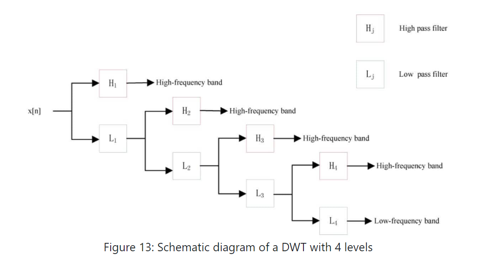

# PSSMCOOL

This package includs all features that has been extracted from Position-Specific Scoring Matrix (PSSM) in POSSUM website: http://possum.erc.monash.edu/ and some of other features
from several articles. each function in this package corresponds to one feature that has extracted from PSSM Matrix.

###### **Install from GitHub :  devtools::install_github("BioCool-Lab/PSSMCOOL")**


## 1 Preface
<br></br>
<font size="4"> Feature extraction or feature encoding is a fundamental step in the construction of high-quality machine learning-based models. Specifically, this is a key step for determining the effectiveness of the trained models in bioinformatics applications. In the last two decades, a variety of feature encoding schemes have been proposed in order to exploit useful patterns from protein sequences. Such schemes are often based on sequence information or physicochemical properties of amino acids. Although direct features derived from sequences themselves (such as amino acid compositions, dipeptide compositions, and counting of k-mers) are regarded as essential for training models, an increasing number of studies have shown that evolutionary information in the form of PSSM profiles is much more informative than sequence information alone. Accordingly, PSSM-based feature descriptors have been commonly used as indispensable primary features to construct models, filling a major gap in the current bioinformatics research. For example, PSSM-based feature descriptors have successfully improved the prediction performance of structural and functional properties of proteins across a wide spectrum of bioinformatics applications. These predictions can be applied for protein fold recognition and the prediction of protein structural classes, protein-protein interactions, protein subcellular localization, RNA-binding sites, and protein functions. But at the same time, there is no comprehensive, simple tool in the R programming language for extracting all of these features from the PSSM and displaying it in the output. PSSMCOOL package here is developed in R for these purposes. First, in Figure 1 which is a table that lists all of the features implemented in this package with their feature-lengths is brought. Then each one of these features will be explained in full detail.</font>

<br></br>

<font size="4"> PSSMCOOL Package is currently available on CRAN website:</font>

[ https://CRAN.R-project.org/package=PSSMCOOL]( https://CRAN.R-project.org/package=PSSMCOOL)

<br></br>

<font size="4"> for issues about this package :</font>

[https://github.com/BioCool-Lab/PSSMCOOL/issues](https://github.com/BioCool-Lab/PSSMCOOL/issues)

<br></br>

<pre>                  Figure 1: List of implemented features in PSSMCOOL package </pre>

<br>*feature vector length depends on the choice of parameter</br>  **these features produce Matrix of features which its dimension depends on choice of parameter

<br></br>

```{r}
library(PSSMCOOL)
```

## 2 PSSM-AC
<font size="4">This feature, which stands for auto-covariance transformation, for column j, calculates the average of this column as shown in Figure 2, Then subtracts the resulting number from the elements on the rows i and i + g of this column, and finally multiplies them and calculates the sum by changing the variable i from 1 to L-g. Because the variable j changes between 1 and 20 and the variable g changes between 1 and 10, eventually a feature vector of length 200 will be obtained.</font>

<br></br>

<br></br>
<pre>                   Figure 2: process of extracting PSSM-AC feature vector from PSSM Matrix </pre>


## 3 DPC-PSSM
<font size="4">This feature stands for dipeptide composition, which multiplies the values that are located in two consecutive rows and two different columns. Having calculated these values for different rows and columns, they are summed. Next, for both columns, the sum is divided by L-1. Since the result depends on two different columns, eventually a feature vector of length 400, according to Figure 3 and following equation ,will be obtained.</font>
<br></br>


<pre>                   Figure 3: process of extracting DPC-PSSM feature vector from PSSM Matrix </pre>
<br></br>


## 4 Trigram-PSSM
<font size="4">This feature vector is of length 8000, which is extracted from the PSSM. If we multiply elements available in three consecutive rows and three different columns of the PSSM by each other, and apply this to all rows (all three consecutive rows) and then sum these numbers, eventually one of the elements of feature vector with length 8000 corresponding to the three selected columns will be obtained. Because we have 20 different columns, The final feature vector will be of length 8000 = 20 * 20 * 20. Figure 4: shows these steps. For example, in this figure for three marked rows and columns, the numbers obtained from the intersection of these rows and columns marked with a blue dotted circle around them, are multiplied to each other. </font>


<pre>                   Figure 4: process of extracting trigram-PSSM feature vector from PSSM </pre>
<br></br>


<br></br>

## 5 Pse-PSSM
<font size="4"> The length of this feature vector is 320. The first 20 numbers of this feature vector are the mean of 20 columns in PSSM, and the next values for each column are the mean squares of the difference between the elements of row i and i + lag in this column. Because the lag value varies between 1 and 15, the final feature vector will have a length of 320. Figure 5: and following equation shows the process of this function and the corresponding mathematical equation, respectively.</font>


<pre>                  Figure 5: process of extracting Pse-PSSM feature vector from PSSM </pre>
<br></br>


## 6 k-Separated-bigram-PSSM
<font size="4"> This feature is almost identical to the DPC feature, and in fact, the DPC feature is part of this feature (for k = 1) and for two different columns, it considers rows that have distance k.</font>


<pre>                  Figure 6: process of extracting K-separated-bigam-PSSM feature vector from PSSM </pre>


## 7 EDP-EEDP-MEDP
<font size="4"> In this group of features, in order to use uniform dimensions to show proteins of different lengths, in the first step, the average evolutionary score between adjacent residues is calculated using the following equations:</font>


<pre>                  Figure 7: process of extracting EDP-EEDP-MEDP feature vectors from PSSM </pre>
<br></br>


## 8 AB-PSSM
<font size="4"> This feature consists of two types of feature vectors. At first, each protein sequence is divided into 20 equal parts, each of which is called a block, and in each block, the row vectors of the PSSM
related to that block are added together. The resulting final vector is divided by the length of that block, which is equal to 5% of protein length. Finally, by placing these 20 vectors side by side, the first feature vector of length 400 is obtained. The second feature for each amino acid in each column is the average of the positive numbers in that column and for each block, and these 20 values, corresponding to 20 blocks, are placed next to each other, and therefore for each of the 20 types of amino acids, a vector of length 20 is obtained, and by placing these together,the second feature vector of length 400, is obtained. Figure 8 represents this process.</font>


<pre>                  Figure 8: process of extracting AB-PSSM feature vectors from PSSM </pre>


## 9 AATP-TPC
<font size="4"> In this feature, at first, a TPM matrix is constructed from the PSSM, which has represented by a vector corresponding to the following equation:</font>


<font size="4"> In the above equation, the numerator is the same as the equation related to DPC-PSSM feature without considering its coefficient. By placing these components together, a TPC feature vector of length 400 is obtained, and if we add the AAC feature vector of length 20 which is the average of columns of the PSSM to the beginning of this vector, AATP feature vector of length 420 is obtained.</font>


## 12 SCSH2

<font size="4"> To generate this feature vector, the consensus sequence corresponding to the protein sequence is extracted using the PSSM. Then, by placing these two sequences next to each other, a matrix with dimensions of 2 * L will be created. In the next step, each component in the upper row of this matrix is connected to two components in the lower row of this matrix, and thus a graph similar to a bipartite graph could be created.
Now in this graph, each path of length 2 specifies a 3-mer and each path of length 1 denotes a 2-mer corresponding to these two sequences. Now if we consider a table consisting of two rows and 8000 columns so that the first row contains all possible 3-mers of 20 amino acids, then for every 3-mer obtained from this graph, we put number 1 below the corresponding cell With that 3-mer in the aforementioned table and 0 in other cells. so This gives us a vector of length 8000. For the 2-mers obtained from this graph, a vector of length 400 is obtained in a similar way. figures 10, 11 show these processes. </font>
<br></br>




## 17 Disulfide_PSSM
<font size="4">For the purpose of predicting disulfide bond in protein at first, the total number of cysteine amino
acids in the protein sequence is counted and their position in the protein sequence is identified.
Then, using a sliding window with a length of 13, moved on the PSSM from top to bottom so
that the middle of the window is on the amino acid cysteine, then the rows below the matrix obtained
from the PSSM with the dimension of 13 x 20 are placed next to each other to get a feature vector
with a length of 260 = 20 * 13 per cysteine. If the position of the first and last cysteine in the
protein sequence is such that the middle of sliding window is not on cysteine residue while moving
on PSSM, then the required number of zero rows from top and bottom is added to the PSSM
matrix to achieve this goal.Thus, for every cysteine amino acid presented in protein sequence, a
feature vector with a length of 260 is formed.Then all the pairwise combinations of these cysteines
is wrote in the first column of a table. In front of each of these pairwise combinations, the
corresponding feature vectors are stuck together to get a feature vector of length 520 for each of
these compounds.Finally, the table obtained in this way will have the number of rows equal to the
number of all pairwise combinations of these cysteines and the number of columns will be equal to
521 (the first column includes the name of these pair combinations). It is easy to divide this
table into training and testing data and predict the desired disulfide bonds between cysteines.Figure 14 shows a schematic of this process:</font>


<br></br>

## 23 MBMGACPSSM
<font size="4">In this feature three different autocorrelation descriptors based on PSSM are adopted, which include: normalized Moreau-Broto autocorrelation, Moran autocorrelation and Geary autocorrelation
descriptors.Autocorrelation descriptor is a powerful statistical tool and defined based on the distribution of amino acid properties along the sequence, which measures the correlation between two
residues separated by a distance of d in terms of their evolution scores.</font>

<br></br>

<br></br>

## 24 LPC-PSSM
<font size="4">This feature uses Linear predictive coding algorithm for each column of PSSM. So for
producing this feature vector "lpc" function from "phontools" R-package is used which produces a 14-dimensional vector for each column, since PSSM has 20 column eventually it will be obtained a 20*14=280 dimensional feature vector for each PSSM.</font> 

<br></br>

<br></br>

## 25 PSSM400
<font size="4">To generate this feature vector, for each of the standard amino acids, we find the positions containing that amino acid in the protein and separate the corresponding rows in the PSSM, to get a submatrix. Now, for the generated matrix, we calculate the average of its columns, and therefore, for each amino acid, a vector of length 20 is obtained. Finally, by putting these 20 vectors together, a feature vector of length 400 for each protein can be obtained. For example figure 16 shows the PSSM rows corresponding to amino acid S.</font>


<br></br>

## 26 PSSM-BLOCK
<font size="4"> In this feature at first PSSM is divided to Blocks based on Number N which user imports.
Then for each Block the mean of columns is computed to get 20-dimensional vector, eventually by
appending these vectors to each other final feature vector is obtained.</font> 

<br></br>

<br></br>


<br></br>

## 28 PSSM-SEG
<font size="4"> This feature, similar to the previous feature, divides each column into four parts and calculates the values for each column. Then, using the following equations, it calculates the values of Segmented Auto Covariance Features. The final feature vector length will be of length 100.</font>


<br></br>


<br></br>


<br></br>


# Sample implementation

 ## install.packages('caret', dependencies = TRUE)
library(caret) \
 ##in this script I'm going to do classification using the data set prepared by Alireza
setwd("F:\\article400\\javad2")
bmp.R2.submission.data.df <- read.csv("DataSet2.csv")
dim(bmp.R2.submission.data.df)#1730  102
View(bmp.R2.submission.data.df)
 ##Assigning the Uniprot IDs for each protein pairs to the row name
rownames(bmp.R2.submission.data.df) <- 
  bmp.R2.submission.data.df$interactions
 ##Removing the Uniprot IDs 
bmp.R2.submission.data.df <- 
  bmp.R2.submission.data.df[,-1]
dim(bmp.R2.submission.data.df)#1730  101
table(bmp.R2.submission.data.df$class)
 ##Interaction Non-Interaction 
 #865             865 
bmp.R2.submission.data.df$class <- 
  as.factor(bmp.R2.submission.data.df$class)

 ##setting.the.trainControl===========
setting.the.trainControl.3 <- function()
{
  ##setting the trainControl function parameter: repeated CV; downsampling; 
  set.seed(100)
  fitControl <- trainControl(## 10-fold CV
    method = "cv",
    returnData = TRUE,
    classProbs = TRUE,
  )
  return(fitControl)
  
}
 ##setting cross validation parameters
trainControl.for.PSSM <- setting.the.trainControl.3()

 ##10-fold cross-validation using "Bagged CART (treebag)" classifier=======
cross.validation.bulit.model.treebag <- 
  train(class ~ ., data = bmp.R2.submission.data.df, 
      method = "treebag", 
      trControl = trainControl.for.PSSM, 
      verbose = FALSE)

print(cross.validation.bulit.model.treebag$results)
 ## parameter Accuracy    Kappa  AccuracySD    KappaSD
 ## 1      none 0.995947 0.991893 0.005486098 0.01097446


 ##10-fold cross-validation using "Single C5.0 Tree (C5.0Tree)" classifier=======
cross.validation.bulit.model.C5.0Tree <- 
  train(class ~ ., data = bmp.R2.submission.data.df, 
        method = "C5.0Tree", 
        trControl = trainControl.for.PSSM, 
        verbose = FALSE)


print(cross.validation.bulit.model.C5.0Tree$results)
 ### parameter  Accuracy     Kappa  AccuracySD    KappaSD
 ### 1      none 0.9965351 0.9930693 0.005582827 0.01116793

 ##10-fold cross-validation using "Partial Least Squares (pls)" classifier=======
cross.validation.bulit.model.pls <- 
  train(class ~ ., data = bmp.R2.submission.data.df, 
        method = "pls", 
        trControl = trainControl.for.PSSM, 
        verbose = FALSE)

print(cross.validation.bulit.model.pls$results)
 ## ncomp  Accuracy       Kappa AccuracySD    KappaSD
 ## 1     1 0.5034885  0.01032276 0.01831448 0.03438894
 ## 2     2 0.4861705 -0.02718683 0.05446108 0.10915104
 ## 3     3 0.5427787  0.08574924 0.04465618 0.08864498


